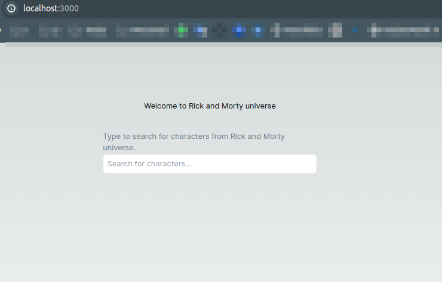
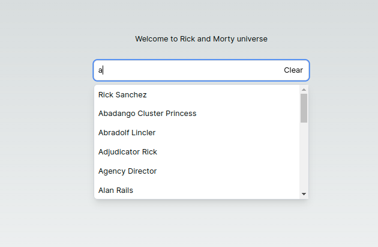
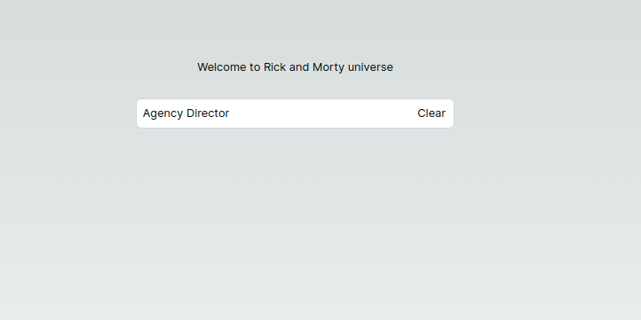

# Welcome to the solution for the challenge!

This project fetches data from a given API and implements search functionality for at least one type of entity. Here’s how it works:

## Technology Stack

- **Programming Language**: TypeScript
- **Frontend Framework**: Next.js
- **Styling**: Tailwind CSS
- **API Integration**: Apollo Client (GraphQL)
- **Runtime Environment**: Node.js

## Purpose

This web application allows users to search for entities (e.g., products, users, or any other relevant data). When users type in the search field, suggestions appear based on their input. Clicking on a suggestion completes the search field with the selected name.

## Prerequisites

Before you begin, ensure you have met the following requirements:

- You have installed Node.js

## Installing and Running the Solution

To install and run the solution, follow these steps:

1. Clone the repository:

```
git clone git@github.com:thsvr/rings.git
```

2. Navigate to the project directory:

```
cd sandbox
```

3. Install the dependencies:

```
npm i
```

4. Run the solution:

```
npm run dev
```

5.Open [localhost](http://localhost:3000) to view it in the browser.

## Screenshots





## Author

👤 _Thais Vieira_

[Github: @thsvr](https://github.com/thsvr)

[Thais' LinkedIn](https://www.linkedin.com/in/vr-ths-zd/)
